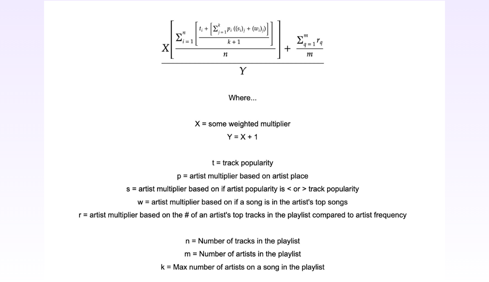

# How is my music taste?
Do I listen to trendy arists and songs?

It's easy to guess "yes" or "no" on my own, but unless I actually look at the
data, I'll never know.

That's why I'm doing this project.

I'm accessing Spotify's API and pulling data to analyze my recently played
songs and which artists show up in my playslists the most.

The equation below takes into account certain factors to score one's taste in music:

For a more in-depth breakdown of this project, visit [my Dorky Data post here](https://www.dorkydata.com/projects/creating-a-python-algorithm-to-score-my-taste-in-music)